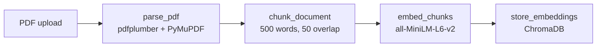
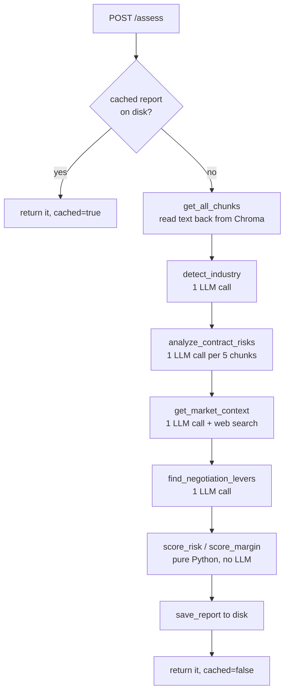

# ContractSense — Codebase Guide

A file-by-file walkthrough of how this app works, written to be read top to
bottom. `README.md` tells you how to *run* it; this tells you how it *works* and
why each piece is built the way it is.

---

## Table of contents

1. [The big idea](#1-the-big-idea)
2. [The two journeys](#2-the-two-journeys)
3. [Directory map](#3-directory-map)
4. [Core concepts you need first](#4-core-concepts-you-need-first)
5. [Backend, file by file](#5-backend-file-by-file)
6. [Frontend, file by file](#6-frontend-file-by-file)
7. [Library cheat sheet](#7-library-cheat-sheet)
8. [Failure modes this code defends against](#8-failure-modes-this-code-defends-against)
9. [How to extend it](#9-how-to-extend-it)
10. [Dead code and known rough edges](#10-dead-code-and-known-rough-edges)

---

## 1. The big idea

A pricing team is handed a contract. They need two things fast:

1. **Where am I exposed?** → a **risk score**, 0-100, driven by risky clauses
   *and* "hidden clauses" — auto-renewals, uncapped price escalation, minimum
   commitments. The stuff that reads as boilerplate and costs money later.
2. **Where can I push back?** → a **margin meter**, 0-100, from comparing the
   contract's commercial terms against what the rest of the industry gets.

The central design decision is this:

> **The LLM's job is to spot things. Python's job is to weigh them.**

The model reads the contract and reports findings in a **closed vocabulary** —
`risk_level` is exactly one of `LOW`/`MEDIUM`/`HIGH`, `position` is exactly one
of five values. Then plain Python arithmetic turns those findings into the two
scores.

Why bother? Because if you ask a model "score this contract 0-100," you get 71
today and 64 tomorrow on the same document, and you can't explain either number
to a customer. With a formula, the same findings *always* produce the same
score, and every score ships with the reasons behind it.

---

## 2. The two journeys

### Journey A — indexing (`POST /upload`)

Happens once per contract. Cheap, no LLM involved.



### Journey B — assessment (`POST /assess`)

The expensive one. Cached to disk afterwards, so it runs once.



Note step C. `/upload` already parsed and chunked this contract, so `/assess`
reads the text **back out of ChromaDB** instead of asking you to upload the file
again. (The older `/analyze` and `/extract` endpoints do re-upload — that's the
pattern the newer code moved away from.)

---

## 3. Directory map

```
contractsense/
├── docker-compose.yml          # two services + named volumes
├── .env.example                # OPENAI_API_KEY and optional tuning
│
├── backend/                    # FastAPI, Python 3.11
│   ├── Dockerfile
│   ├── requirements.txt
│   ├── scripts/run_pipeline.py # debugging script (NOT a test)
│   ├── tests/                  # pytest — only the pure logic is tested
│   └── app/
│       ├── main.py             # FastAPI app, CORS, /health
│       ├── core/config.py      # env-var settings
│       ├── api/routes.py       # every endpoint + request/response models
│       ├── data/benchmarks.json# checked-in industry norms
│       └── services/           # all the real logic
│           ├── pdf_parser.py   #  PDF  → text
│           ├── chunker.py      #  text → chunks
│           ├── embedder.py     #  text → vectors
│           ├── vector_store.py #  vectors ↔ ChromaDB
│           ├── llm.py          #  every OpenAI call
│           ├── risk_analyzer.py#  orchestrates clause analysis
│           ├── benchmarks.py   #  loads benchmarks.json
│           ├── market.py       #  web search + negotiation levers
│           ├── scoring.py      #  the two 0-100 formulas (pure)
│           └── report_store.py #  disk cache for assessments
│
└── frontend/                   # Next.js 15 App Router, React 19, TS, Tailwind v4
    └── src/
        ├── app/page.tsx        # the whole UI shell + tabs
        ├── lib/types.ts        # mirrors the Pydantic models
        ├── lib/api.ts          # thin fetch wrappers
        └── components/         # one file per tab, plus ui.tsx
```

**The layering rule:** `routes.py` does HTTP things (validation, status codes)
and nothing else. All logic lives in `services/`, and each service is
independently importable. That's why `scoring.py` can be unit-tested without a
server, a database, or an API key.

---

## 4. Core concepts you need first

### Embeddings

An **embedding** turns text into a list of numbers (a *vector*) that captures
its meaning. Similar meanings land near each other in that space — even with no
shared words. "How do I cancel?" ends up near "termination for convenience."

This app uses `all-MiniLM-L6-v2`, which produces a **384-number vector** per
chunk. It runs locally on the CPU — no API call, no cost.

### Cosine similarity

To measure "nearness," we compare the *angle* between two vectors, not the
distance between them. Angle is better for text because it ignores magnitude —
a long clause and a short one about the same topic still point the same way.

ChromaDB returns a *distance*, so we flip it into a similarity:

```python
# vector_store.py
"similarity_score": round(1 - distance, 4),
# 1.0 = identical, 0.0 = unrelated
```

### RAG (Retrieval-Augmented Generation)

You can't paste a 40-page contract into every prompt — it's slow and expensive.
So instead:

1. **Retrieve** — embed the user's question, find the 4 nearest chunks.
2. **Augment** — paste only those 4 chunks into the prompt.
3. **Generate** — ask the model to answer *from that text only*.

The model sees ~2,000 words instead of 20,000, and because you told it to answer
only from the provided text, it's far less likely to invent clauses.

### Chunking, and why it overlaps

The model can't embed a whole document as one vector — you'd lose all detail. So
we split it into ~500-word chunks. But a hard split can cut a sentence in half
and destroy its meaning, so consecutive chunks **overlap by 50 words**:

```
chunk 0: words 0   → 500
chunk 1: words 450 → 950     ← repeats 450-500
chunk 2: words 900 → 1400    ← repeats 900-950
```

That's why the loop advances by `chunk_size - chunk_overlap`, not `chunk_size`.

---

## 5. Backend, file by file

### `app/main.py` — the entry point

Tiny. Creates the FastAPI app, wires up CORS, mounts the routes.

```python
app.add_middleware(
    CORSMiddleware,
    allow_origins=settings.cors_origin_list,
    allow_credentials=True,
    allow_methods=["*"],
    allow_headers=["*"],
)
app.include_router(routes.router)
```

**Why CORS matters:** your browser refuses to let a page on `localhost:3000`
call an API on `localhost:8000` unless that API explicitly says it's allowed.
Different port = different origin. Without this middleware every frontend
request fails with an opaque browser error.

| Library thing | What it does |
|---|---|
| `FastAPI(...)` | The app object. Also auto-generates the docs at `/docs`. |
| `CORSMiddleware` | Adds the `Access-Control-Allow-Origin` headers browsers demand. |
| `app.include_router` | Mounts everything defined in `routes.py`. |

---

### `app/core/config.py` — settings

```python
class Settings(BaseSettings):
    openai_api_key: str = ""
    openai_model: str = "gpt-4o-mini"
    chunk_size: int = 500
    analysis_batch_size: int = 5
    enable_web_search: bool = True
    cors_origins: str = "http://localhost:3000"

    @property
    def cors_origin_list(self) -> list[str]:
        return [o.strip() for o in self.cors_origins.split(",") if o.strip()]

settings = Settings()
```

`BaseSettings` (from `pydantic-settings`) reads each field from an environment
variable of the same name, **case-insensitively**. So `chunk_size` is filled
from `CHUNK_SIZE`. It also type-casts: `ANALYSIS_BATCH_SIZE=5` arrives as the
string `"5"` and comes out as the integer `5`.

`settings` is created once at import. Every module does
`from app.core.config import settings` and shares that one object.

**Why `cors_origin_list` is a property:** env vars can only hold strings, so
multiple origins arrive as `"http://a.com,http://b.com"`. The property splits
that into the list FastAPI actually wants, so the awkward format stays in one
place.

---

### `app/services/pdf_parser.py` — PDF → text

```python
@dataclass
class ParsedDocument:
    filename: str
    total_pages: int
    raw_text: str
    pages: list[dict]
    metadata: dict
```

A `@dataclass` is Python's shorthand for "a class that just holds fields." The
decorator writes `__init__`, `__repr__` and `__eq__` for you. You get
`doc.raw_text` attribute access instead of `doc["raw_text"]` dict lookups, plus
autocomplete and typo-catching.

The interesting part is the **two-parser fallback**:

```python
for page_num, page in enumerate(pdf.pages, start=1):
    text = page.extract_text() or ""

    # If pdfplumber gets nothing, try PyMuPDF
    if not text.strip():
        text = _extract_page_with_pymupdf(str(file_path), page_num - 1)
```

PDFs are a genuinely awful format. There is no "text" in a PDF — there are
glyphs at coordinates, and extraction is guesswork. pdfplumber and PyMuPDF guess
differently, and pages that defeat one often work in the other. Trying both
costs nothing on the pages where the first one works.

`enumerate(pdf.pages, start=1)` gives human page numbers (1, 2, 3) while
`page_num - 1` converts back to PyMuPDF's 0-based index.

| Function | Purpose |
|---|---|
| `parse_pdf(path)` | The main entry. Returns `ParsedDocument`, raises `ValueError` if nothing extractable. |
| `get_document_stats(doc)` | Page/word/char counts for the UI header. |
| `_extract_metadata(pdf)` | Title, author, creator from the PDF header. |
| `_extract_page_with_pymupdf(...)` | The fallback extractor. |
| `_clean_text(text)` | Strips null bytes, normalises newlines, collapses whitespace. |
| `is_likely_scanned(doc)` | **Currently unused** — see §10. |

The leading underscore on `_clean_text` is a Python convention meaning "internal
to this module." Nothing enforces it; it's a signal to readers.

---

### `app/services/chunker.py` — text → chunks

```python
while position < len(words):
    end = min(position + chunk_size, len(words))
    chunk_words = words[position:end]
    ...
    position += chunk_size - chunk_overlap   # ← the overlap
```

Then a quality filter:

```python
# Chunks under 30 words are usually headers, footers, or stray
# section titles. They add noise to search results without
# containing enough context to be useful.
chunks = [chunk for chunk in chunks if chunk.word_count >= 30]
```

**Why word-based, not character-based:** splitting at character 500 can land
mid-word. Words are a natural boundary and roughly track tokens, which is what
the model actually costs money in.

`_estimate_page` deserves an honest note — it does **not** track real page
provenance:

```python
progress = word_position / total_words
estimated_page = int(progress * doc.total_pages) + 1
```

If you're 50% through the words of a 4-page document, it says page 2. That's
fine for a "page 3" hint in the UI and wrong if pages have very different
densities.

| Function | Purpose |
|---|---|
| `chunk_document(doc, size, overlap)` | The main entry. Returns `list[TextChunk]`. |
| `get_chunk_stats(chunks)` | Counts and averages, used by the debug script. |
| `print_chunk_boundaries(chunks)` | Prints the start of each chunk so you can eyeball whether your chunk size is sane. |
| `_estimate_page(...)` | Proportional page guess. |

---

### `app/services/embedder.py` — text → vectors

```python
_model = None

def get_model() -> SentenceTransformer:
    global _model
    if _model is None:
        print(f"Loading embedding model: {settings.embedding_model}")
        _model = SentenceTransformer(settings.embedding_model)
    return _model
```

This is the **lazy singleton** pattern, and it's the most important idea in this
file. The model is ~90MB and takes seconds to load. Loading it per request would
be unusable; loading it at import would slow every startup even for requests
that never embed anything. So: load on first use, reuse forever.

The `global` keyword is required — without it, `_model = ...` would create a new
*local* variable and the cache would never populate.

You'll see the same pattern in `benchmarks.py` (`_benchmarks`).

```python
embeddings = model.encode(texts, show_progress_bar=True)
```

`model.encode` takes a **list** and batches internally — much faster than
calling it per string. It returns numpy arrays, so `.tolist()` converts them to
plain Python lists that JSON and ChromaDB can handle.

---

### `app/services/vector_store.py` — ChromaDB

ChromaDB is the vector database. `PersistentClient` writes to disk, so your
index survives a restart.

```python
collection = client.get_or_create_collection(
    name=collection_name,
    metadata={"hnsw:space": "cosine"},
)
```

`hnsw:space` sets the distance metric. HNSW is the index algorithm — it finds
approximate nearest neighbours fast, without comparing your query against every
single vector.

One collection per document, named after the file. Storage takes four parallel
lists:

```python
collection.upsert(
    ids=ids,               # unique per chunk
    embeddings=embeddings, # the 384-number vectors
    documents=documents,   # the original text
    metadatas=metadatas,   # page_num, chunk_index, word_count
)
```

Keeping the original text in `documents` is what makes `get_all_chunks` possible
— Chroma doubles as the text store, so nothing has to re-parse the PDF.

| Function | Purpose |
|---|---|
| `get_chroma_client()` | Opens the on-disk client. |
| `get_or_create_collection(client, name)` | Idempotent collection handle. |
| `store_embeddings(name, chunks)` | Writes chunks. `upsert` = insert or overwrite. |
| `search(name, query_vec, n)` | Nearest-neighbour lookup, returns text + similarity. |
| `get_all_chunks(name)` | **Reads the whole document back**, sorted by `chunk_index`. |
| `collection_exists(name)` | Existence check that does *not* create anything. |

Two subtleties worth internalising:

```python
# get_all_chunks — Chroma makes no ordering promise, and reading a
# contract out of order would scramble the analysis
chunks.sort(key=lambda c: c["chunk_index"])
```

```python
# collection_exists — deliberately NOT using get_or_create_collection,
# which would create an empty collection as a side effect
existing = [c.name for c in client.list_collections()]
```

That second one is a real trap: the obvious implementation of "does this exist?"
would silently make it exist.

---

### `app/services/llm.py` — every OpenAI call

The single most important file to understand. All model access lives here so
prompts, retries and fallbacks stay in one place.

#### `chat_json` — the shared JSON helper

```python
def chat_json(prompt: str, system: str, max_tokens: int, fallback: dict) -> dict:
    response = client.chat.completions.create(
        model=settings.openai_model,
        messages=[
            {"role": "system", "content": system},
            {"role": "user", "content": prompt},
        ],
        temperature=0,
        max_tokens=max_tokens,
        response_format={"type": "json_object"},
    )

    choice = response.choices[0]
    raw = choice.message.content.strip()

    if choice.finish_reason == "length":
        print(f"LLM response hit the {max_tokens} token limit and was truncated. ...")

    try:
        return json.loads(raw)
    except json.JSONDecodeError:
        print("LLM returned invalid JSON — using fallback.")
        return fallback
```

Four things are load-bearing here:

- **`temperature=0`** — as deterministic as the API gets. Creativity is the
  enemy when the output feeds a score.
- **`response_format={"type": "json_object"}`** — *JSON mode*. The API
  constrains generation so the output is always parseable JSON. Asking politely
  in the prompt is not enough; models still wrap things in ```` ```json ````
  fences.
- **The `fallback`** — one bad response degrades one clause instead of 500ing
  the whole request.
- **The `finish_reason` check** — this one was added after a real bug. See §8.

**`messages` roles:** `system` sets persistent behaviour ("you always respond
with valid JSON"); `user` is the actual request. `max_tokens` caps the
*response*, not the input.

#### `analyze_clause_batch` — the workhorse

Analyses up to `analysis_batch_size` chunks in one call. The prompt is worth
studying because two details in it are the difference between working and
silently broken.

**Detail 1 — the watchlist is closed:**

```python
HIDDEN_CLAUSE_WATCHLIST = """- auto_renewal: the contract renews itself unless cancelled in a specific window
- unilateral_price_increase: one side can raise prices at its own discretion
- evergreen_term: the term extends indefinitely with no natural end
...
- minimum_commitment: a volume or spend floor you pay for whether you use it or not"""
```

An open-ended "find anything sneaky" gives you a different answer every run,
with a different vocabulary each time. Useless when the count feeds a penalty.
A fixed list makes the output comparable across contracts.

**Detail 2 — "excerpt," not "clause":**

```python
numbered = "\n\n".join(
    f"=== EXCERPT {i} ===\n{text}"
    for i, text in enumerate(clause_texts, start=1)
)
```

```
Each excerpt may itself contain several numbered contract sections.
Do NOT return one object per numbered section. Return one object per
EXCERPT, summarising that whole excerpt, however many sections it contains.
```

The original version labelled these `[CLAUSE 0]` and asked for "one object per
clause." Contracts are themselves full of numbered clauses ("1. FEES. 2. TERM.")
so the model enumerated *those* — returning 12 objects for 1 input chunk. The
word "excerpt" doesn't collide with contract vocabulary.

#### `_align_batch` — defensive alignment

The caller zips this output against the original chunks. If the list is short or
reordered, every analysis attaches to the wrong text — silently.

```python
for position, item in enumerate(items):
    number = item.get("excerpt")
    if isinstance(number, int) and 1 <= number <= expected:
        by_position[number - 1] = item
    elif position < expected:
        # No usable number — trust the order it came back in
        by_position.setdefault(position, item)
```

Then every gap is padded with a safe default, so the output length **always**
equals the input length. This is the code `tests/test_llm.py` exists to protect.

#### `chat_with_web_search` — the Responses API

```python
return client.responses.create(
    model=settings.openai_model,
    instructions=system,
    input=prompt,
    tools=[{"type": tool_type}],
)
```

Two different OpenAI APIs are in play:

| | Chat Completions | Responses |
|---|---|---|
| Call | `client.chat.completions.create` | `client.responses.create` |
| Input | `messages=[{role, content}]` | `input=` + `instructions=` |
| Output | `.choices[0].message.content` | `.output_text` |
| Hosted tools | no | **yes — `web_search`** |

The hosted `web_search` tool means OpenAI runs the search on their side. No
Tavily key, no Serper key, no scraping. The **model decides** whether a search is
needed — a question about the contract's own wording won't trigger one.

Sources come back as annotations on the output, which `_extract_sources` walks:

```python
for item in response.output:
    for content in getattr(item, "content", None) or []:
        for annotation in getattr(content, "annotations", None) or []:
            if getattr(annotation, "type", "") != "url_citation":
                continue
```

The `getattr(x, "y", None) or []` idiom is defensive: not every output item has
`content`, and not every content block has `annotations`. This tolerates both a
missing attribute and a `None` value.

| Function | Purpose |
|---|---|
| `chat_json(...)` | Shared JSON-mode call with truncation warning + fallback. |
| `chat_with_web_search(...)` | Responses API + hosted search. Honours `ENABLE_WEB_SEARCH`. |
| `analyze_clause_batch(texts)` | Risk + hidden clauses + `is_commercial`, N in one call. |
| `detect_industry(sample, keys)` | Picks an industry, **constrained to real keys**. |
| `extract_key_terms(text)` | Parties, dates, governing law (the older `/extract` tab). |
| `answer_question(q, chunks)` | Plain RAG answer (the older `/ask` tab). |
| `answer_with_advice(...)` | RAG + assessment + benchmarks + web search. |
| `analyze_clause(text)` | **Currently unused** — see §10. |
| `_responses_create_with_search` | Tries `web_search`, falls back to `web_search_preview`. |
| `_extract_sources(response)` | Pulls deduplicated citation URLs. |
| `_align_batch(analyses, n)` | Forces one entry per input chunk. |

One more guard worth copying elsewhere:

```python
# detect_industry — never trust the model to stay inside the list
if result.get("industry") not in valid_keys:
    result["industry"] = "default"
```

Constraining a value in the prompt is a request. Validating it in code is a
guarantee.

---

### `app/services/risk_analyzer.py` — orchestration

No prompts here. It slices chunks into batches, calls the LLM, and reshapes the
results.

```python
for start in range(0, len(chunks), batch_size):
    batch = chunks[start:start + batch_size]
    analyses = analyze_clause_batch([c["text"] for c in batch])

    for chunk, analysis in zip(batch, analyses):
        ...
```

`range(0, len, step)` is the standard batching idiom. `zip` pairs each chunk
with its analysis — which only works because `_align_batch` guarantees equal
lengths.

It produces three things the assessment needs:

```python
return {
    "all_clauses": clause_analyses,          # → score_risk
    "hidden_clauses": hidden_clauses,        # → score_risk + the UI
    "commercial_clauses": commercial_clauses,# → find_negotiation_levers
    ...
}
```

`commercial_clauses` is a filter: only clauses the model flagged
`is_commercial` go to the negotiation step. No point asking "how does this
compare on price?" about a confidentiality clause.

`_empty_report()` returns a **valid, empty** report rather than
`{"error": ...}`. Callers splat this straight into a Pydantic model, so an error
dict would explode at the response boundary with a confusing message.

---

### `app/data/benchmarks.json` — the cached market knowledge

Plain JSON, checked into git, meant to be edited by hand.

```json
{
  "saas": {
    "display_name": "SaaS / Software",
    "benchmarks": [
      {
        "key": "annual_uplift",
        "label": "Annual price uplift cap",
        "market_norm": "3-5% or CPI, whichever is lower",
        "buyer_favourable": "CPI capped at 3%, first renewal flat",
        "note": "Uncapped uplift is the single most common hidden cost in SaaS..."
      }
    ]
  }
}
```

Six industries plus `default`. This is the **stable** half of "market data" — it
never hallucinates and never goes down. Web search supplies the fresh half.

> ⚠️ The repo's `.gitignore` used to contain a bare `data/`, which also matched
> `backend/app/data/` and would have silently excluded this file from git. It's
> now anchored to `/backend/data/`. Worth remembering whenever you put
> checked-in content in a folder called `data`.

---

### `app/services/benchmarks.py` — loading them

Same lazy singleton as the embedder. The two functions that matter:

```python
def get_industry(industry_key: str | None) -> dict:
    table = load_benchmarks()
    key = (industry_key or "").strip().lower()
    if key not in table:
        key = DEFAULT_INDUSTRY      # always returns something usable
    ...
```

```python
def format_benchmark_table(industry: dict) -> str:
    """A compact text table costs far fewer tokens than raw JSON
    and the model follows it just as well."""
    for b in industry["benchmarks"]:
        lines.append(f"- {b['key']} | {b['label']} | market norm: {b['market_norm']} | ...")
```

That second one is a genuinely useful prompt-engineering habit: don't paste JSON
into prompts when a line-per-row table conveys the same thing in half the
tokens.

---

### `app/services/market.py` — web search + levers

```python
try:
    result = chat_with_web_search(prompt=prompt, system=...)
except Exception as e:
    # Never let a flaky search break an assessment
    print(f"Market lookup failed, continuing without it: {e}")
    return {"summary": "", "trends": [], "sources": []}
```

**Best-effort by design.** Web search is the least reliable dependency in the
system, so it can never be the reason an assessment fails. Turn it off with
`ENABLE_WEB_SEARCH=false` and everything still works off benchmarks alone.

#### `_split_summary_and_trends` — parsing prose, not JSON

Why not JSON here, when everything else uses JSON mode? Because JSON mode and
the web-search tool don't combine well — forcing JSON tends to lose the
citations. So we ask for a simple labelled format and parse it:

```python
# Models write markdown as often as not, whatever the prompt says.
# Bold markers would otherwise break the heading check and show up
# verbatim in the UI as "**SUMMARY:**" and "Payment terms**: ...".
stripped = line.replace("**", "").replace("__", "").strip().strip("#").strip()
```

That comment is the record of a real bug: `**SUMMARY:**` failed
`startswith("SUMMARY")` and got rendered literally in the UI.

#### `find_negotiation_levers` — the early return that fixes a wrong score

```python
# A document with no commercial terms at all — an NDA, say — has
# nothing to benchmark. Generating levers anyway would advise the
# user to negotiate payment terms into a confidentiality agreement,
# and would score it as high leverage for having none of them.
if not commercial_clauses:
    return []
```

Without this, an NDA scored **70 / STRONG_LEVERAGE** — because all seven
benchmarks came back `not_addressed`, which normally means "easy win." For an
NDA it means "irrelevant." Returning `[]` makes `score_margin` report `UNKNOWN`,
which is the honest answer.

#### `_clean_levers` — guarding the closed vocabulary

```python
VALID_POSITIONS = {"worse_than_market", "slightly_worse", "at_market",
                   "better_than_market", "not_addressed"}

"position": position if position in VALID_POSITIONS else "at_market",
```

`scoring.py` maps `position` through a fixed table. An unexpected value would
fall through to a default and quietly distort the margin meter. Validate at the
boundary, so the scoring code can trust its input.

| Function | Purpose |
|---|---|
| `get_market_context(type, industry)` | Web search → summary, trends, sources. Fails soft. |
| `find_negotiation_levers(...)` | One lever per benchmark, with a concrete ask. |
| `summarise_for_advice(assessment)` | Flattens a report into prompt text for `/advise`. |
| `_split_summary_and_trends(text)` | Parses the labelled reply, strips markdown. |
| `_clean_levers(levers, industry)` | Drops unknown keys, forces valid enums, dedupes. |

---

### `app/services/scoring.py` — the two formulas

**The most important file, and the only one with no dependencies.** No LLM, no
disk, no network — just arithmetic. That's what makes it testable and what makes
the scores defensible.

```python
CLAUSE_SEVERITY = {"HIGH": 100, "MEDIUM": 45, "LOW": 10}
HIDDEN_CLAUSE_PENALTY = 6
HIDDEN_CLAUSE_CAP = 30
```

Note `MEDIUM = 45`, not 50. The comment explains why:

```python
# MEDIUM sits well below the midpoint because most contracts are
# mostly medium — if MEDIUM scored 50 every contract would look average.
```

#### Risk

```python
base = sum(severities) / len(severities)
penalty = min(HIDDEN_CLAUSE_CAP, HIDDEN_CLAUSE_PENALTY * len(hidden_clauses))
score = _clamp(round(base + penalty), 0, 100)
```

The `min(...)` cap stops twenty hidden clauses from adding 120 points, and
`_clamp` guarantees the 0-100 contract regardless.

#### Margin

```python
LEVER_OPPORTUNITY = {
    "worse_than_market": 90,
    "not_addressed": 70,
    "slightly_worse": 55,
    "at_market": 20,
    "better_than_market": 5,
}

TOP_LEVERS_COUNTED = 5
```

Only the strongest five count:

```python
# A contract with three glaring problems has real leverage; averaging
# those away against twenty fine-as-they-are terms would hide it.
scored.sort(key=lambda pair: pair[0], reverse=True)
top = scored[:TOP_LEVERS_COUNTED]
score = _clamp(round(sum(value for value, _ in top) / len(top)), 0, 100)
```

Worked example — 2 bad terms among 17:

| Approach | Maths | Score | Band |
|---|---|---|---|
| Average all 17 | (90+90+20×15)/17 | 28 | TIGHT ❌ |
| Average top 5 | (90+90+20+20+20)/5 | 48 | SOME_ROOM ✅ |

Two genuinely off-market terms *are* leverage. The first approach hides them.

#### Drivers — why the score is trustworthy

```python
if high:
    drivers.append(f"{high} high-risk clause{_s(high)} found.")
if hidden_clauses:
    drivers.append(
        f"{len(hidden_clauses)} hidden clause{_s(len(hidden_clauses))} "
        f"adding {penalty} points: {', '.join(types[:4])}."
    )
```

Every score returns `{score, band, drivers}`. The UI renders the drivers under
each meter. **A number nobody can interrogate is not useful to a team defending
a position across a negotiating table.**

| Function | Purpose |
|---|---|
| `score_risk(clauses, hidden)` | → `{score, band, drivers}`, bands LOW/MODERATE/HIGH. |
| `score_margin(levers)` | → `{score, band, drivers}`, bands UNKNOWN/TIGHT/SOME_ROOM/STRONG_LEVERAGE. |
| `sort_levers(levers)` | Biggest wins first: by position, then impact. |
| `_band(score, bands)` | Maps 0-100 onto a band name. |
| `_clamp(v, lo, hi)` | `max(lo, min(hi, v))`. |
| `_s(count)` | Pluraliser so driver strings read naturally. |

---

### `app/services/report_store.py` — the disk cache

```python
def _report_path(collection_name: str) -> Path:
    return Path(settings.reports_dir) / f"{collection_name}.json"
```

`Path / "file.json"` is `pathlib`'s overloaded division operator for joining
paths — cross-platform, unlike string concatenation with `/` or `\`.

```python
try:
    with open(path, "r", encoding="utf-8") as f:
        return json.load(f)
except (json.JSONDecodeError, OSError) as e:
    print(f"Ignoring unreadable report {path}: {e}")
    return None       # a corrupt cache is treated as no cache
```

A corrupt cache file should never crash a request — worst case you recompute.
`encoding="utf-8"` is explicit because Windows otherwise defaults to cp1252 and
mangles the `£`, `—` and `’` characters that turn up constantly in contracts.

No database. One JSON file per contract is genuinely enough here, and adding
Postgres to hold a handful of reports would be all cost and no benefit.

---

### `app/api/routes.py` — the HTTP layer

#### Pydantic models

```python
class ScoreDetail(BaseModel):
    score: int
    band: str
    drivers: list[str]

class AssessmentResponse(BaseModel):
    collection_name: str
    risk: ScoreDetail
    margin: ScoreDetail
    hidden_clauses: list[HiddenClause]
    levers: list[NegotiationLever]
    ...
    cached: bool
```

These do four jobs at once:

1. **Validate** incoming JSON — a missing field auto-returns HTTP 422 with a
   clear message.
2. **Serialise** outgoing objects to JSON.
3. **Document** — `/docs` is generated from these.
4. **Contract** — `frontend/src/lib/types.ts` mirrors them by hand.

#### The filename guard

```python
def safe_collection_name(filename: str) -> str:
    stem = Path(filename).stem.lower().replace(" ", "_")
    cleaned = re.sub(r"[^a-z0-9_-]", "", stem).strip("_-")

    if len(cleaned) < 3:
        cleaned = f"doc_{cleaned}" if cleaned else "document"

    return cleaned[:63]
```

The name goes into both a file path and a Chroma collection name. The original
code used the raw browser-supplied filename, which is a path-traversal risk
(`../../etc/passwd.pdf`) and can break Chroma's naming rules. `Path(...).stem`
strips directories *and* the extension; the regex allows only safe characters.

#### `/assess` — the orchestrator

```python
if not collection_exists(collection_name):
    raise HTTPException(status_code=404, detail=f"No uploaded contract named ...")

# Serve the cache unless told not to, or the user picked a different industry
if not request.refresh:
    cached = load_report(collection_name)
    if cached and (not request.industry or cached["industry"] == request.industry):
        return AssessmentResponse(**cached, cached=True)
```

`AssessmentResponse(**cached, cached=True)` — the `**` unpacks the dict into
keyword arguments. `cached=True` is added separately because it isn't stored in
the file; it describes *this response*, not the report.

The industry check matters: if you override saas → logistics, the cached saas
report is the wrong answer even though a cache exists.

```python
except HTTPException:
    raise                      # let our own 404s through untouched
except Exception as e:
    raise HTTPException(status_code=500, detail=f"Assessment failed: {str(e)}")
```

Without that first clause, the bare `except` would catch the deliberate 404 and
relabel it a 500.

| Endpoint | Method | What it does |
|---|---|---|
| `/upload` | POST | Parse → chunk → embed → index. |
| `/assess` | POST | The full assessment. Cached. |
| `/assess/{name}` | GET | Cached report only, 404 if never assessed. |
| `/advise` | POST | RAG + assessment + benchmarks + web search. |
| `/industries` | GET | Dropdown options. |
| `/ask` | POST | Plain RAG answer. |
| `/search` | POST | Vector search, no LLM. |
| `/analyze` | POST | Older per-clause risk report (re-uploads the file). |
| `/extract` | POST | Key terms (re-uploads the file). |
| `/health` | GET | Liveness. |

---

## 6. Frontend, file by file

### `src/lib/types.ts`

```ts
// Mirrors the Pydantic response models in backend/app/api/routes.py.

export type LeverPosition =
  | "worse_than_market"
  | "slightly_worse"
  | "at_market"
  | "better_than_market"
  | "not_addressed";
```

A **union of string literals** — TypeScript will reject any other value at
compile time, and your editor autocompletes the five. This mirrors the backend's
`VALID_POSITIONS` set; the closed vocabulary runs end to end.

These are hand-maintained. Change a Pydantic model and you must change this file
— nothing generates it.

### `src/lib/api.ts`

```ts
async function request<T>(path: string, init: RequestInit): Promise<T> {
  let res: Response;
  try {
    res = await fetch(`${API_URL}${path}`, init);
  } catch {
    throw new Error(`Cannot reach the API at ${API_URL}. Is the backend running?`);
  }
  if (!res.ok) throw await toError(res);
  return res.json() as Promise<T>;
}
```

`<T>` is a **generic** — the caller states the expected shape and gets it typed:

```ts
assess: (collection_name: string, industry?: string, refresh = false) =>
  request<AssessmentResponse>("/assess", withJson({ collection_name, industry: industry ?? null, refresh })),
```

Two things worth noting:

- **`fetch` only rejects on network failure.** An HTTP 500 is a *successful*
  fetch as far as the promise is concerned. That's why `if (!res.ok)` is a
  separate, explicit check — a very common source of bugs.
- **`toError`** normalises FastAPI's two error shapes (a `detail` string, or the
  array of objects a 422 returns) into one readable message.

### `src/components/ui.tsx` — the design system

Five primitives: `Card`, `Button`, `Spinner`, `ErrorBanner`, `EmptyState`,
`RiskBadge`, `Stat`. The pattern to copy:

```tsx
const RISK_STYLES: Record<RiskLevel, string> = {
  HIGH: "border-red-500/40 bg-red-500/15 text-red-300",
  MEDIUM: "border-amber-500/40 bg-amber-500/15 text-amber-300",
  LOW: "border-emerald-500/40 bg-emerald-500/15 text-emerald-300",
};
```

A lookup object keyed by the union type. `Record<RiskLevel, string>` forces you
to handle every case — add a risk level and TypeScript flags the gap.

`bg-red-500/15` is Tailwind's opacity syntax: red-500 at 15% alpha. On a dark
surface that gives a tint rather than a slab.

### `src/app/page.tsx` — the shell

The entire app state is three `useState` calls:

```tsx
const [file, setFile] = useState<File | null>(null);
const [doc, setDoc]   = useState<UploadResponse | null>(null);
const [tab, setTab]   = useState<Tab>("Score");
```

No Redux, no Zustand, no context. For a single-page tool this is genuinely
enough — reach for a state library when you have a problem, not before.

**Why both `file` and `doc`?** The newer endpoints (`/assess`, `/advise`,
`/search`) take a `collection_name` and read from Chroma. The older ones
(`/analyze`, `/extract`) re-post the file. So we keep both until those two are
migrated.

```tsx
{tab === "Score" && <ScorePanel collection={doc.collection_name} />}
{tab === "Risk"  && <RiskPanel file={file} />}
```

`{condition && <Component />}` renders the component only when the condition
holds. Note this **unmounts** the inactive panel — switching tabs loses its
local state.

### `src/components/ScorePanel.tsx` — the meters

Two colour maps, and the difference between them is a deliberate design choice:

```tsx
/**
 * Risk is a status: low is good, high is bad. So it uses the same
 * red / amber / emerald tokens as the rest of the app.
 */
const RISK_METER = {
  LOW:      { fill: "bg-emerald-500", ... },
  MODERATE: { fill: "bg-amber-500",   ... },
  HIGH:     { fill: "bg-red-500",     ... },
};

/**
 * Margin is not a status — a tight contract isn't an error, it just has
 * less room. So it uses one accent hue that gets stronger as the score
 * rises... That also stops the two meters contradicting each other,
 * where high means bad on one and good on the other.
 */
const MARGIN_METER = {
  TIGHT:           { fill: "bg-indigo-500/40", ... },
  SOME_ROOM:       { fill: "bg-indigo-500/70", ... },
  STRONG_LEVERAGE: { fill: "bg-indigo-400",    ... },
};
```

If both meters used red→green, a reader would see high-red on one and high-green
on the other and have to stop and think. Risk *is* a status, so it gets status
colours. Margin is a *magnitude* of opportunity, so it gets a single hue that
intensifies. Each meter also states its direction in words ("Higher means
riskier").

The meter itself is a div with a percentage width — no charting library:

```tsx
<div
  role="meter"
  aria-valuenow={detail.score}
  aria-valuemin={0}
  aria-valuemax={100}
  aria-label={`${title}: ${detail.score} of 100, ${style.label}`}
  className="mt-4 h-2 overflow-hidden rounded-full bg-white/5"
>
  <div className={`h-full rounded-full ${style.fill}`} style={{ width: `${detail.score}%` }} />
</div>
```

A single ratio against a fixed limit is a **meter**, not a chart. Pulling in
Recharts for this would add ~50KB to render one rectangle. The `role`/`aria-*`
attributes make it readable by screen readers.

**The cache-first mount:**

```tsx
useEffect(() => {
  let cancelled = false;

  api.getAssessment(collection)
    .then((cached) => { if (cancelled) return; setResult(cached); ... })
    .catch(() => {});          // a 404 here is the normal case, not an error

  return () => { cancelled = true; };
}, [collection]);
```

Two React patterns:

- **The `cancelled` flag.** If the component unmounts before the fetch resolves,
  calling `setResult` would warn and leak. The cleanup function returned from
  `useEffect` flips the flag.
- **The empty `.catch(() => {})`.** Deliberate. "No cached assessment" is the
  expected state for a new contract, not a failure to report.

### `src/components/NegotiatePanel.tsx`

Renders levers as side-by-side comparison cards — contract position vs market
norm — with the ask highlighted. Same `POSITIONS` lookup-object pattern, and
each badge carries **words as well as colour** ("Below market"), so the meaning
never depends on colour alone.

### `src/components/ChatPanel.tsx`

Calls `/advise`, keeps a `Turn[]` array, auto-scrolls:

```tsx
const bottomRef = useRef<HTMLDivElement>(null);

useEffect(() => {
  bottomRef.current?.scrollIntoView({ behavior: "smooth" });
}, [turns, busy]);
```

`useRef` holds a mutable value that survives re-renders without triggering one.
Attached to an empty div at the bottom of the list, it's the standard
scroll-to-bottom trick.

Sources render in two `<details>` blocks — contract chunks and web citations.
`<details>`/`<summary>` is a native HTML collapsible; no JavaScript needed.

### The panel pattern

Every panel repeats the same three-state shape. Learn it once:

```tsx
const [result, setResult] = useState<T | null>(null);
const [busy, setBusy] = useState(false);
const [error, setError] = useState<string | null>(null);

async function run() {
  setError(null);
  setBusy(true);
  try {
    setResult(await api.something(...));
  } catch (e) {
    setError(e instanceof Error ? e.message : "Something failed.");
  } finally {
    setBusy(false);          // runs on both success and failure
  }
}
```

`finally` is what guarantees the spinner always stops. `e instanceof Error` is
needed because JavaScript lets you `throw` literally anything.

---

## 7. Library cheat sheet

### Python

| Library | Used for | Key calls |
|---|---|---|
| **fastapi** | HTTP framework | `APIRouter`, `@router.post`, `HTTPException`, `UploadFile` |
| **pydantic** | Validation + serialisation | `BaseModel` |
| **pydantic-settings** | Env config | `BaseSettings` |
| **uvicorn** | ASGI server | `uvicorn app.main:app --reload` |
| **pdfplumber** | Primary PDF text | `.open()`, `.pages`, `.extract_text()` |
| **PyMuPDF** (`fitz`) | Fallback PDF text | `fitz.open()`, `page.get_text("text")` |
| **sentence-transformers** | Local embeddings | `SentenceTransformer(...)`, `.encode()` |
| **chromadb** | Vector DB | `PersistentClient`, `.upsert()`, `.query()`, `.get()` |
| **openai** | The model | `chat.completions.create`, `responses.create` |
| **pytest** | Tests | plain `assert` |

### Python standard library worth knowing here

| Thing | Where | What it does |
|---|---|---|
| `@dataclass` | `pdf_parser`, `chunker` | Auto-writes `__init__`/`__repr__`/`__eq__`. |
| `pathlib.Path` | everywhere | `/` joins paths; `.stem`, `.suffix`, `.exists()`. |
| `json.load/dump` | `report_store`, `llm` | Parse/write JSON. |
| `re.sub` | `pdf_parser`, `routes` | Regex replace. |
| `min`/`max` | `scoring` | The clamp idiom. |
| `zip` | `risk_analyzer` | Pair two equal-length lists. |
| `enumerate(x, start=1)` | `pdf_parser`, `llm` | Index while looping, 1-based. |
| `range(0, n, step)` | `risk_analyzer` | Batching. |
| `dict.get(k, default)` | everywhere | Safe lookup on model output. |
| `global` | `embedder`, `benchmarks` | Required to assign to a module-level cache. |

### TypeScript / React

| Thing | Where | What it does |
|---|---|---|
| `useState` | every panel | Local state; re-renders on change. |
| `useEffect` | `ScorePanel`, `ChatPanel` | Side effects; cleanup via the returned function. |
| `useRef` | `ChatPanel`, `UploadPanel` | Mutable value that doesn't re-render. |
| `fetch` | `api.ts` | HTTP. **Only rejects on network failure.** |
| `FormData` | `api.ts` | Multipart file upload. |
| Union types | `types.ts` | Compile-time closed vocabularies. |
| `Record<K, V>` | `ui.tsx` | Exhaustive lookup objects. |
| Generics `<T>` | `api.ts` | Caller states the response type. |
| `??` | `api.ts` | Nullish coalescing — falls back only on `null`/`undefined`. |
| `?.` | `ChatPanel` | Optional chaining. |
| `void promise()` | event handlers | "I know this is async; I'm not awaiting it." |

---

## 8. Failure modes this code defends against

Every one of these was a real bug caught during development. They're the most
useful part of this document.

### 1. The model enumerated the wrong thing

**Symptom:** a deliberately awful contract scored 45/MODERATE with zero hidden
clauses. A clean bill of health on a terrible document — the worst possible
failure, because it looks like a working answer.

**Cause:** the prompt labelled inputs `[CLAUSE 0]` and asked for "one object per
clause." The contract itself contained `1. FEES`, `2. TERM`, `3. RENEWAL`… so the
model returned 12 objects for 1 input chunk. That blew the token budget, the JSON
truncated, parsing failed, and the fallback said "nothing found."

**Fixes:** renamed the unit to "excerpt" (a word contracts don't use), stated
explicitly that excerpts contain multiple numbered sections, made `_align_batch`
tolerate extras, and added `tests/test_llm.py`.

**Lesson:** your prompt's vocabulary can collide with the document's vocabulary.

### 2. Silent truncation

**Symptom:** as above.

**Cause:** `max_tokens` was too small. The API returns HTTP 200 with valid-looking
but cut-off JSON.

**Fix:** check `finish_reason` explicitly and log loudly.

```python
if choice.finish_reason == "length":
    print(f"LLM response hit the {max_tokens} token limit and was truncated. ...")
```

**Lesson:** a truncated response is not an error at the API level. If you don't
check, you get a silent wrong answer.

### 3. An NDA with "strong negotiating leverage"

**Symptom:** a confidentiality agreement scored 70/STRONG_LEVERAGE and advised
negotiating payment terms into it.

**Cause:** all seven benchmarks returned `not_addressed`, which scores 70
because a missing standard protection is usually an easy win. For an NDA it just
means "irrelevant."

**Fix:** early-return `[]` when there are no commercial clauses → `UNKNOWN`.

**Lesson:** "absent" and "not applicable" are different, and a scoring table
can't tell them apart on its own.

### 4. `**SUMMARY:**` rendered literally

Prompt said "no markdown." Model used markdown anyway. Fixed by stripping
emphasis before parsing. **Lesson:** prompt instructions are requests; parse
defensively.

### 5. `data/` in `.gitignore` matched two different folders

`backend/app/data/benchmarks.json` — checked-in content — was silently ignored.
Fixed by anchoring to `/backend/data/`. **Lesson:** unanchored gitignore
patterns match at every level.

### 6. `pytest` ran the whole embedding pipeline

`backend/test_parse.py` was a script with top-level statements, but its name
matched pytest's collection pattern, so importing it executed the pipeline.
Renamed to `backend/scripts/run_pipeline.py`.

---

## 9. How to extend it

### Add an industry

Add a block to `backend/app/data/benchmarks.json`. That's the whole job — the
dropdown, the detector's valid-key list, and the lever prompt all read from that
file.

```json
"healthcare": {
  "display_name": "Healthcare / Life Sciences",
  "benchmarks": [
    { "key": "payment_terms", "label": "Payment terms",
      "market_norm": "Net 45", "buyer_favourable": "Net 60",
      "note": "..." }
  ]
}
```

### Add a hidden-clause type

Add a line to `HIDDEN_CLAUSE_WATCHLIST` in `llm.py`. The penalty maths and the UI
both handle new types automatically.

### Change the scoring weights

Edit the constants at the top of `scoring.py`, then run `pytest` — several tests
assert exact values and will tell you what moved.

### Make the assessment cheaper

- `ANALYSIS_BATCH_SIZE=8` — fewer calls (watch for truncation warnings).
- `ENABLE_WEB_SEARCH=false` — drops one call and the search cost.
- `OPENAI_MODEL=...` — one place, applies everywhere.

### Support .docx

Add a parser in `pdf_parser.py` returning the same `ParsedDocument`, and relax
the `.pdf` check in `routes.py`. Nothing downstream cares where the text came
from — that's the payoff of the dataclass boundary.

---

## 10. Dead code and known rough edges

Honest inventory, so you don't waste time wondering.

**Defined but never called:**

| Function | File | Note |
|---|---|---|
| `analyze_clause` | `llm.py` | Superseded by `analyze_clause_batch`. Useful as the simpler version to read first. |
| `is_likely_scanned` | `pdf_parser.py` | Would be a good guard on `/upload`. |
| `delete_report` | `report_store.py` | `save_report` overwrites, so refresh doesn't need it. |
| `from annotated_types import doc` | `pdf_parser.py:3` | Stray import, does nothing. |

**Rough edges:**

- **`/analyze` and `/extract` still re-upload the file.** `/assess` reads from
  Chroma instead. Migrating them is the obvious next cleanup.
- **`_estimate_page` is proportional, not real.** Page numbers are approximate.
- **`chunk_index` has gaps.** Sub-30-word chunks are filtered *after* indices are
  assigned, so the surviving indices aren't contiguous. Ordering still works.
- **No pagination or streaming.** A long assessment is one slow request with a
  spinner. Server-sent events would be the fix.
- **No way to list indexed contracts.** Refreshing the page loses access to a
  contract that's still indexed. A `GET /contracts` endpoint would fix it.
- **Frontend types are hand-maintained.** Nothing enforces that `types.ts`
  matches the Pydantic models. Generating from the OpenAPI schema would.

**What's tested and what isn't:**

`pytest` covers the pure logic — `scoring.py` fully, plus the non-LLM helpers in
`market.py` and `llm.py`. That's 35 tests, all running in under a second with no
API key.

Not covered: the endpoints, the PDF parser, and anything that calls OpenAI. The
line was drawn at "does it need a network call or a fixture?" — the deterministic
core is where bugs are both most likely and most damaging, and it's free to test.
